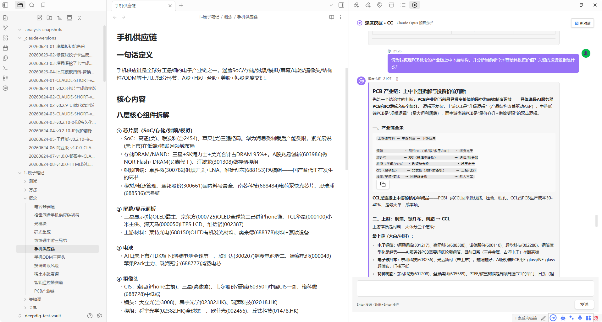
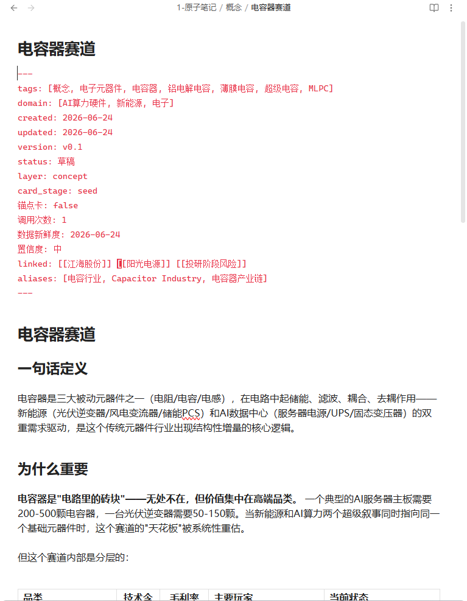
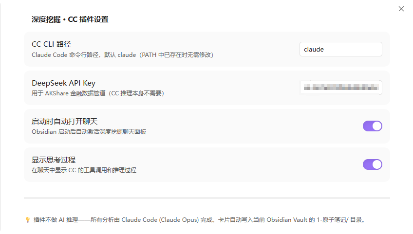
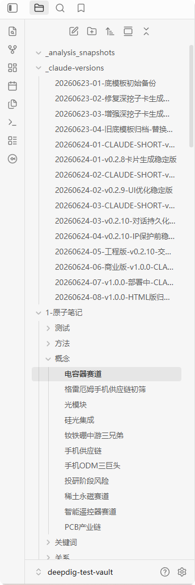

# DeepDig CC — Investment Research in Obsidian, Powered by Claude Opus

[](https://obsidian.md)
[](LICENSE)

**Not a ChatGPT wrapper. Not a stock screener. Not a note-taking tool.**

DeepDig CC is an AI investment research engine that runs inside Obsidian. You chat with it like a human analyst — it runs Claude Opus 4 under the hood, streams its reasoning into the chat panel, and silently writes structured knowledge cards into your Obsidian vault.

---

## What It Does

|<div style="width:120px">You say...</div>|What happens|
|---|---|
|"Deep dive into NIO 300750"|Pulls 10 years of financials + runs 5 web searches → 10-dimension report + 7 linked sub-cards written to your vault|
|"What's the energy storage sector looking like?"|Scans your existing cards → cross-references L1 policy cards / L2 sector cards → gives you a structured answer grounded in your knowledge base|
|"Tell me about sodium-ion batteries"|Searches web → writes a concept card + keyword card → links it to your existing energy storage sector cards|

Every analysis ends with knowledge cards automatically written to `1-原子笔记/` — entities, concepts, keywords, relationships. Your vault grows denser with every conversation.

---

## Features

- **Claude Opus 4 Engine** — flagship Anthropic model, reasoning depth no local model can match
- **Dual-call Architecture** — conversation and card-writing are separate CC runs; chat stays fast, cards are thorough
- **Knowledge Auto-growth** — cards link to ≥3 existing cards, forming a self-densifying knowledge network
- **10-Dimension Deep Dive** — moat analysis, governance scoring, growth quality, earnings authenticity, valuation (PE/PB/DCF/Graham anchor), risk matrix, competitive dynamics, and a "Master Panel" (Graham / Lynch / Munger / Duan Yongping / Howard Marks)
- **Full Offline Fallback** — license validated locally; online Gumroad check only every 7 days
- **7-Day Free Trial** — full features, no credit card required
- **Privacy First** — your API key and vault never leave your machine

---

## Screenshots

|Chat Panel|Knowledge Cards|
|---|---|
|||

|Settings — License Key|Vault Structure|
|---|---|
|||

---

## Installation

### Prerequisites

|Software|Required?|Notes|
|---|---|---|
|Obsidian|✅|v1.5.0 or later|
|Node.js|✅|v18 or later (for Claude Code CLI)|
|Claude Code CLI|✅|`npm install -g @anthropic-ai/claude-code`|
|Anthropic API Key|✅|Your own key — [console.anthropic.com](https://console.anthropic.com)|

### Quick Install

1. **Install the plugin** — copy `main.js`, `manifest.json`, `styles.css` into `.obsidian/plugins/deepdig-cc/`
2. **Initialize your vault** — run `scripts/init-vault.sh [your-vault-path]` (or `init-vault.bat` on Windows)
3. **Enable the plugin** — Obsidian Settings → Community Plugins → toggle "深度挖掘 · CC"
4. **Start chatting** — click the ribbon icon on the left sidebar
5. **First time?** — 7-day free trial. No license key needed.

> 🤖 **Instructions**: Copy the command you need to terminal:
>
> ```bash
> # Windows (Command Prompt or PowerShell)
> scripts\init-vault.bat "C:\Users\you\Documents\MyVault"
>
> # macOS / Linux
> chmod +x scripts/init-vault.sh && ./scripts/init-vault.sh ~/Documents/MyVault
> ```

### One-Click Installer

For non-technical users who don't have Node.js or CC CLI installed, download the one-click installer from [deepdig.beaver-cloud.com/setup](https://deepdig.beaver-cloud.com/setup). It bundles Node.js portable + CC CLI + plugin files (~60MB).

---

## License Key

DeepDig CC requires a license key after the 7-day free trial.

|Plan|Price|
|---|---|
|Monthly|$10/mo|
|Annual|$72/yr (save 40%)|

**Get a key**: [deepdig.beaver-cloud.com](https://deepdig.beaver-cloud.com) → purchase via Gumroad → paste the key into Obsidian Settings → DeepDig CC.

**Why license key?** Claude Opus API costs are paid by you directly to Anthropic (~$0.1-0.5 per deep dive). The license fee covers the encrypted engine cards (28 proprietary investment frameworks) and the knowledge base auto-growth system.

---

## How It Works

```
┌──────────────────────────────────────────────┐
│                   Obsidian                     │
│  ┌────────────────┐  ┌─────────────────────┐  │
│  │   Chat Panel    │  │    Your Vault        │  │
│  │                 │  │                      │  │
│  │  You ←→ CC     │  │  1-原子笔记/         │  │
│  │  (streaming)    │  │  ├ 概念/             │  │
│  │                 │  │  ├ 实体/             │  │
│  │  CC writes ────→│  │  ├ 关键词/          │  │
│  │  cards to vault │  │  ├ 关系/             │  │
│  │                 │  │  └ 投资思想/         │  │
│  └────────────────┘  └─────────────────────┘  │
│                                                  │
│  Claude Code CLI (child_process.spawn)          │
│  ├ decrypt → 28 encrypted engine cards           │
│  ├ scan → existing L1/L2/keyword cards           │
│  ├ inject → full context into CC stdin           │
│  └ call 1: analysis + reply (60 turns)           │
│  └ call 2: write cards to vault (40 turns)       │
└──────────────────────────────────────────────────┘
```

---

## Privacy

- **Your API key stays on your machine.** Set as `ANTHROPIC_API_KEY` env var or in plugin settings. Never transmitted anywhere.
- **Your vault content stays on your machine.** No telemetry, no analytics, no cloud upload.
- **License validation** is a single `POST` to `api.gumroad.com` every 7 days. No vault data in the request.
- **Claude Code CLI** makes API calls directly from your machine to Anthropic. We never proxy or see your requests.

---

## Requirements

|Requirement|Minimum|Recommended|
|---|---|---|
|OS|Windows 10 / macOS 12 / Ubuntu 22.04|Windows 11 / macOS 14|
|RAM|4 GB|8 GB+|
|Disk|1 GB free|5 GB+ (vault growth)|
|Network|Broadband (API calls)|Stable broadband|

---

## Development

```bash
git clone https://github.com/deepdig-cc/deepdig-cc.git
cd deepdig-cc
npm install
npm run build     # one-off build
npm run watch     # watch mode
```

---

## License

MIT © DeepDig

---

🤖 Built with [Claude Code](https://claude.ai/code)
